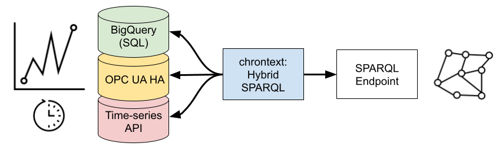

# chrontext: High-performance hybrid query engine for knowledge graphs and analytical data (e.g. time-series)
Chrontext allows you to use your knowledge graph to access large amounts of time-series or other analytical data. It uses a commodity SPARQL Triplestore and your existing data storage infrastructure.
It currently supports time-series stored in a PostgreSQL-compatible Database such as DuckDB, Google Cloud BigQuery (SQL) and OPC UA HA, but can easily be extended to other APIs and databases.


Chrontext forms a semantic layer that allows self-service data access, abstracting away technical infrastructure. 
Users can create query-based inputs for data products, that maintains these data products as the knowledge graph is maintained, and that can be deployed across heterogeneous on-premise and cloud infrastructures with the same API. 

Chrontext is a high-performance Python library built in Rust using [Polars](https://www.pola.rs/), and relies heavily on packages from the [Oxigraph](https://github.com/oxigraph/oxigraph) project. 
Chrontext works with [Apache Arrow](https://arrow.apache.org/), prefers time-series transport using [Apache Arrow Flight](https://arrow.apache.org/docs/format/Flight.html) and delivers results as [Polars](https://www.pola.rs/) DataFrames.

Please reach out to [Data Treehouse](https://www.data-treehouse.com/contact-8) if you would like help trying Chrontext, or require support for a different database backend. 

## Installing
Chrontext is in pip, just use:
```shell
pip install chrontext
```
The API is documented [HERE](https://datatreehouse.github.io/chrontext/chrontext/chrontext.html). 

## Example query in Python
The code assumes that we have a SPARQL-endpoint and BigQuery set up with time-series. 

```python
...
q = """
PREFIX xsd:<http://www.w3.org/2001/XMLSchema#>
PREFIX ct:<https://github.com/DataTreehouse/chrontext#>
PREFIX rdfs: <http://www.w3.org/2000/01/rdf-schema#> 
PREFIX rds: <https://github.com/DataTreehouse/solar_demo/rds_power#> 
SELECT ?path ?t ?ts_pow_value ?ts_irr_value
WHERE {
    ?site a rds:Site;
    rdfs:label "Jonathanland";
    rds:functionalAspect ?block.
    # At the Block level there is an irradiation measurement:
    ?block a rds:A;
    ct:hasTimeseries ?ts_irr.
    ?ts_irr rdfs:label "RefCell1_Wm2".
    
    # At the Inverter level, there is a Power measurement
    ?block rds:functionalAspect+ ?inv.
    ?inv a rds:TBB;
    rds:path ?path;
    ct:hasTimeseries ?ts_pow.
    ?ts_pow rdfs:label "InvPDC_kW".
    
    ?ts_pow ct:hasDataPoint ?ts_pow_datapoint.
    ?ts_pow_datapoint ct:hasValue ?ts_pow_value;
        ct:hasTimestamp ?t.
    ?ts_irr ct:hasDataPoint ?ts_irr_datapoint.
    ?ts_irr_datapoint ct:hasValue ?ts_irr_value;
        ct:hasTimestamp ?t.
    FILTER(
        ?t >= "2018-08-24T12:00:00+00:00"^^xsd:dateTime && 
        ?t <= "2018-08-24T13:00:00+00:00"^^xsd:dateTime)
} ORDER BY ?path ?t 
"""
df = engine.query(q)
```

This produces the following DataFrame:

| path                        | t                       | ts_pow_value | ts_irr_value |
| ---                         | ---                     | ---          | ---          |
| str                         | datetime[ns, UTC]       | f64          | f64          |
| =<Jonathanland>.A1.RG1.TBB1 | 2018-08-24 12:00:00 UTC | 39.74        | 184.0        |
| =<Jonathanland>.A1.RG1.TBB1 | 2018-08-24 12:00:01 UTC | 39.57        | 184.0        |
| =<Jonathanland>.A1.RG1.TBB1 | 2018-08-24 12:00:02 UTC | 40.1         | 184.0        |
| =<Jonathanland>.A1.RG1.TBB1 | 2018-08-24 12:00:03 UTC | 40.05        | 184.0        |
| =<Jonathanland>.A1.RG1.TBB1 | 2018-08-24 12:00:04 UTC | 40.02        | 184.0        |
| …                           | …                       | …            | …            |
| =<Jonathanland>.A5.RG9.TBB1 | 2018-08-24 12:59:56 UTC | 105.5        | 427.5        |
| =<Jonathanland>.A5.RG9.TBB1 | 2018-08-24 12:59:57 UTC | 104.9        | 427.6        |
| =<Jonathanland>.A5.RG9.TBB1 | 2018-08-24 12:59:58 UTC | 105.6        | 428.0        |
| =<Jonathanland>.A5.RG9.TBB1 | 2018-08-24 12:59:59 UTC | 105.9        | 428.0        |
| =<Jonathanland>.A5.RG9.TBB1 | 2018-08-24 13:00:00 UTC | 105.7        | 428.5        |

## API
The API is documented [HERE](https://datatreehouse.github.io/chrontext/chrontext/chrontext.html).

## Tutorial using DuckDB
In the following tutorial, we assume that you have a couple of CSV-files on disk that you want to query.
We assume that you have DuckDB and chrontext installed, if not, do `pip install chrontext duckdb`. 
Installing chrontext will also install sqlalchemy, which we rely on to define the virtualized DuckDB tables.

### CSV files
Our csv files look like this.

ts1.csv :

```
timestamp,value
2022-06-01T08:46:52,1
2022-06-01T08:46:53,10
..
2022-06-01T08:46:59,105
```

ts2.csv:
```
timestamp,value
2022-06-01T08:46:52,2
2022-06-01T08:46:53,20
...
2022-06-01T08:46:59,206
```

### DuckDB setup:
We need to create a class with a method `query` that takes a SQL string its argument, returning a Polars DataFrame. 
In this class, we just hard code the DuckDB setup in the constructor. 
```python
import duckdb
import polars as pl

class MyDuckDB():
    def __init__(self):
        con = duckdb.connect()
        con.execute("SET TIME ZONE 'UTC';")
        con.execute("""CREATE TABLE ts1 ("timestamp" TIMESTAMPTZ, "value" INTEGER)""")
        ts_1 = pl.read_csv("ts1.csv", try_parse_dates=True).with_columns(pl.col("timestamp").dt.replace_time_zone("UTC"))
        con.append("ts1", df=ts_1.to_pandas())
        con.execute("""CREATE TABLE ts2 ("timestamp" TIMESTAMPTZ, "value" INTEGER)""")
        ts_2 = pl.read_csv("ts2.csv", try_parse_dates=True).with_columns(pl.col("timestamp").dt.replace_time_zone("UTC"))
        con.append("ts2", df=ts_2.to_pandas())
        self.con = con


    def query(self, sql:str) -> pl.DataFrame:
        # We execute the query and return it as a Polars DataFrame.
        # Chrontext expects this method to exist in the provided class.
        df = self.con.execute(sql).pl()
        return df

my_db = MyDuckDB()
```

### Defining a virtualized SQL
We first define a sqlalchemy select query involving the two tables. __It is crucial that we have a column labelled "id" here__. Chrontext will modify this query when executing hybrid queries.
```python
from sqlalchemy import MetaData, Table, Column, bindparam
metadata = MetaData()
ts1_table = Table(
    "ts1",
    metadata,
    Column("timestamp"),
    Column("value")
)
ts2_table = Table(
    "ts2",
    metadata,
    Column("timestamp"),
    Column("value")
)
ts1 = ts1_table.select().add_columns(
    bindparam("id1", "ts1").label("id"),
)
ts2 = ts2_table.select().add_columns(
    bindparam("id2", "ts2").label("id"),
)
sql = ts1.union(ts2)
```

Now, we are ready to define the virtualized backend. We will annotate nodes of the graph with a resource data property. 
These data properties will be linked to virtualized RDF triples in the DuckDB backend. The `resource_sql_map` decides which SQL is used for each resource property. 
```python
from chrontext import VirtualizedPythonDatabase

vdb = VirtualizedPythonDatabase(
    database=my_db,
    resource_sql_map={"my_resource": sql},
    sql_dialect="postgres"
)
```

The triple below will link the `ex:myWidget1` to triples defined by the above sql. 
```
ex:myWidget1 ct:hasResource "my_resource" . 
```
However, it will only be linked to those triples corresponding to rows where the identifier column equals the identifier associated with `ex:myWidget1`.
Below, we define that ex:instanceA is only linked to those rows where the `id` column is `ts1`.
```
ex:myWidget1 ct:hasIdentifier "ts1" . 
```
In any such resource sql, the `id` column is mandatory. 
### Relating the Database to RDF Triples
Next, we want to relate the rows in this sql, each containing id, timestamp, value to RDF triples, using a template. __It is crucial to have the column id__.
```python
from chrontext import Prefix, Variable, Template, Parameter, RDFType, Triple, XSD
ct = Prefix("ct", "https://github.com/DataTreehouse/chrontext#")
xsd = XSD()
id = Variable("id")
timestamp = Variable("timestamp")
value = Variable("value")
dp = Variable("dp")
resources = {
    "my_resource": Template(
        iri=ct.suf("my_resource"),
        parameters=[
            Parameter(id, rdf_type=RDFType.Literal(xsd.string)),
            Parameter(timestamp, rdf_type=RDFType.Literal(xsd.dateTime)),
            Parameter(value, rdf_type=RDFType.Literal(xsd.double)),
        ],
        instances=[
            Triple(id, ct.suf("hasDataPoint"), dp),
            Triple(dp, ct.suf("hasValue"), value),
            Triple(dp, ct.suf("hasTimestamp"), timestamp)
        ]
)}
```
This means that our instance `ex:myWidget1`, will be associated with a value and a timestamp (and a blank data point) for each row in `ts1.csv`.
For instance, the first row means we have: 
```
ex:widget1 ct:hasDataPoint _:b1 .
_:b1 ct:hasTimestamp "2022-06-01T08:46:52Z"^^xsd:dateTime .
_:b1 ct:hasValue 1 .
```
Chrontext is created for those cases when this is infeasibly many triples, so we do not want to materialize them, but query them.
### Creating the engine and querying:
The context for our analytical data (e.g. a model of an industrial asset) has to be stored in a SPARQL endpoint.
In this case, we use an embedded Oxigraph engine that comes with chrontext. Now we assemble the pieces and create the engine.
```python
from chrontext import Engine, SparqlEmbeddedOxigraph
oxigraph_store = SparqlEmbeddedOxigraph(rdf_file="my_graph.ttl", path="oxigraph_db_tutorial")
engine = Engine(
    resources,
    virtualized_python_database=vdb,
    sparql_embedded_oxigraph=oxigraph_store)
engine.init()
```
Now we can use our context to query the dataset. The aggregation below are pushed into DuckDB.
The example below is a bit simple, but complex conditions can identify the `?w` and `?s`.
```python
q = """
    PREFIX xsd:<http://www.w3.org/2001/XMLSchema#>
    PREFIX chrontext:<https://github.com/DataTreehouse/chrontext#>
    PREFIX types:<http://example.org/types#>
    SELECT ?w (SUM(?v) as ?sum_v) WHERE {
        ?w types:hasSensor ?s .
        ?s a types:ThingCounter .
        ?s chrontext:hasTimeseries ?ts .
        ?ts chrontext:hasDataPoint ?dp .
        ?dp chrontext:hasTimestamp ?t .
        ?dp chrontext:hasValue ?v .
        FILTER(?t > "2022-06-01T08:46:53Z"^^xsd:dateTime) .
    } GROUP BY ?w
    """
df = engine.query(q)
print(df)
```
This produces the following result:

| w                                   | sum_v         |
|-------------------------------------|---------------|
| str                                 | decimal[38,0] |
| <http://example.org/case#myWidget1> | 1215          |
| <http://example.org/case#myWidget2> | 1216          |

## Roadmap in brief
Let us know if you have suggestions!
### Stabilization
Chrontext will be put into use in the energy industry during the period, and will be stabilized as part of this process. We are very interested in your bug reports!

### Support for Azure Data Explorer / KustoQL
We are likely adding support for ADX/KustoQL. Let us know if this is something that would be useful for you. 

### Support for Databricks SQL
We are likely adding support for Databricks SQL as the virtualization backend. 

### Generalization to analytical data (not just time series!)
While chrontext is currently focused on time series data, we are incrementally adding support for contextualization of arbitrary analytical data. 

### Support for multiple databases
Currently, we only support one database backend at a given time. We plan to support hybrid queries across multiple virtualized databases. 

## References
Chrontext is joint work by Magnus Bakken and Professor [Ahmet Soylu](https://www.oslomet.no/om/ansatt/ahmetsoy/) at OsloMet.
To read more about Chrontext, read the article [Chrontext: Portable Sparql Queries Over Contextualised Time Series Data in Industrial Settings](https://www.sciencedirect.com/science/article/pii/S0957417423006516).

## License
All code produced since August 1st. 2023 is copyrighted to [Data Treehouse AS](https://www.data-treehouse.com/) with an Apache 2.0 license unless otherwise noted.

All code which was produced before August 1st. 2023 copyrighted to [Prediktor AS](https://www.prediktor.com/) with an Apache 2.0 license unless otherwise noted, and has been financed by [The Research Council of Norway](https://www.forskningsradet.no/en/) (grant no. 316656) and [Prediktor AS](https://www.prediktor.com/) as part of a PhD Degree. The code at this state is archived in the repository at [https://github.com/DataTreehouse/chrontext](https://github.com/DataTreehouse/chrontext).
