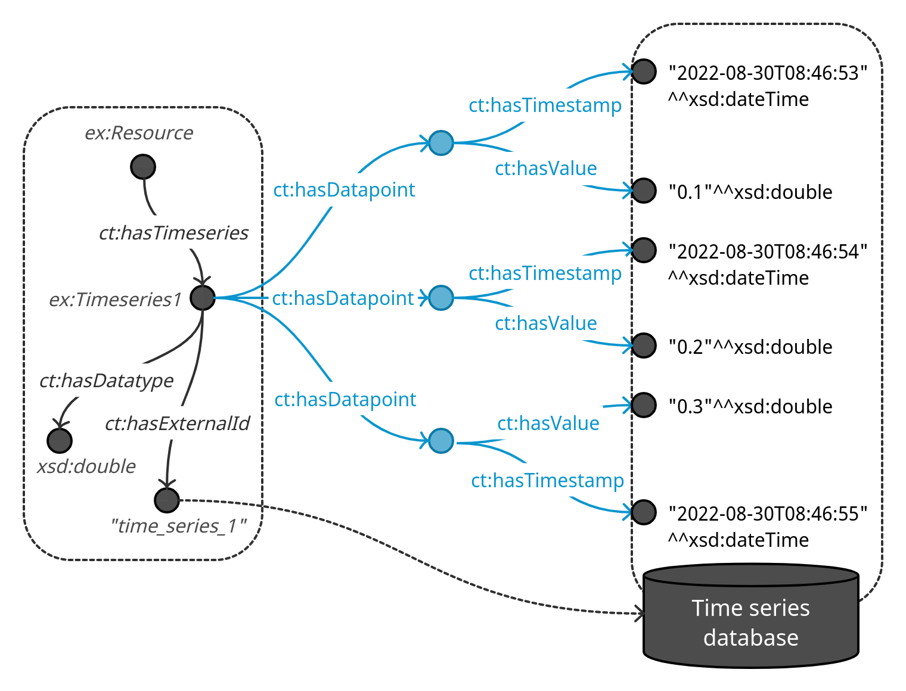
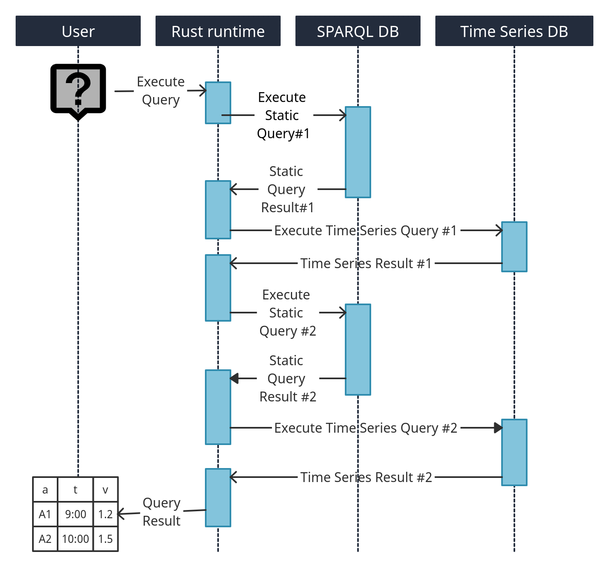

# chrontext
[SPARQL](https://www.w3.org/TR/sparql11-overview/)- and [Apache Arrow](https://arrow.apache.org/)-based high throughput access to time series data residing in an arbitrary time series database which is contextualized by a knowledge graph. 
It is built in [Rust](https://www.rust-lang.org/) using [pola.rs](https://www.pola.rs/), [spargebra](https://docs.rs/spargebra/latest/spargebra/), [sparesults](https://docs.rs/sparesults/0.1.1/sparesults/) and [oxrdf](https://docs.rs/oxrdf/latest/oxrdf/) from the [Oxigraph](https://github.com/oxigraph/oxigraph) project. 

Chrontext is written with data analysts and data engineers who want to extract contextualised time series data as data frames. 
Chrontext allows them to do this in an efficient way using SPARQL. 
It supports data extraction scenarios in industry where data needs to be accessed in cloud data lake and on-premise settings by supporting in principle arbitrary time series database backends. 
Currently, we support OPC UA HA and Dremio (using SQL over Apache Arrow Flight). Chrontext can be configured to push down query executions into the time series database according to its capabilities in order to offload computations and minimize I/O. 

To read more about Chrontext, read the preprint article [Chrontext: Portable Sparql Queries Over Contextualised Time Series Data in Industrial Settings](https://papers.ssrn.com/sol3/papers.cfm?abstract_id=4310978).
This is joint work by Magnus Bakken and Professor [Ahmet Soylu](https://www.oslomet.no/om/ansatt/ahmetsoy/) at OsloMet. 
Please reach out to us if you would like help trying Chrontext. 

## Metadata
Chrontext assumes that we have a knowledge base in a SPARQL database and a time series database. The knowledge base is annotated to link some URIs to identifiers of time series in the time series database. 


## Execution
At query time, we rewrite queries that span both "static" data in the SPARQL database and the time series database into parts that concern the SPARQL engine and the time series database respectively. 
The "static" queries are amended to extract the metadata linking URIs to time series. 
Query execution is then interleaved and results are combined to produce the answer to the original query. 


## Queries in python
We can make queries in Python. The code assumes that we have a SPARQL-endpoint and an Arrow Flight SQL-endpoint (Dremio) set up. 
```python
import pathlib
from chrontext import Engine, TimeseriesDremioDatabase, TimeseriesTable

tables = [
    TimeseriesTable(
        resource_name="my_resource",
        schema="my_nas",
        time_series_table="ts.parquet",
        value_column="v",
        timestamp_column="ts",
        identifier_column="id",
        value_datatype="http://www.w3.org/2001/XMLSchema#unsignedInt")
]
arrow_flight_sql_db = TimeseriesDremioDatabase(host=DREMIO_HOST, port=DREMIO_PORT, username="dremio",
                                                   password="dremio123", tables=tables)
engine = Engine(sparql_endpoint=OXIGRAPH_QUERY_ENDPOINT, timeseries_dremio_db=timeseries_dremio_db)
engine.init()

df = engine.query("""
PREFIX xsd:<http://www.w3.org/2001/XMLSchema#>
PREFIX chrontext:<https://github.com/DataTreehouse/chrontext#>
PREFIX types:<http://example.org/types#>
SELECT ?w ?s ?t ?v WHERE {
    ?w a types:BigWidget .
    ?w types:hasSensor ?s .
    ?s chrontext:hasTimeseries ?ts .
    ?ts chrontext:hasDataPoint ?dp .
    ?dp chrontext:hasTimestamp ?t .
    ?dp chrontext:hasValue ?v .
    FILTER(?t > "2022-06-01T08:46:53"^^xsd:dateTime && ?v < 200) .
}
    """)
```

## Installing pre-built wheels
Chrontext is in pip, just use:
```shell
pip install chrontext
```

## License
All code produced since August 1st. 2023 is copyrighted to [Data Treehouse AS](https://www.data-treehouse.com/) with an Apache 2.0 license unless otherwise noted. 

All code which was produced before August 1st. 2023 copyrighted to [Prediktor AS](https://www.prediktor.com/) with an Apache 2.0 license unless otherwise noted, and has been financed by [The Research Council of Norway](https://www.forskningsradet.no/en/) (grant no. 316656) and [Prediktor AS](https://www.prediktor.com/) as part of a PhD Degree. The code at this state is archived in the repository at [https://github.com/DataTreehouse/chrontext](https://github.com/DataTreehouse/chrontext).
